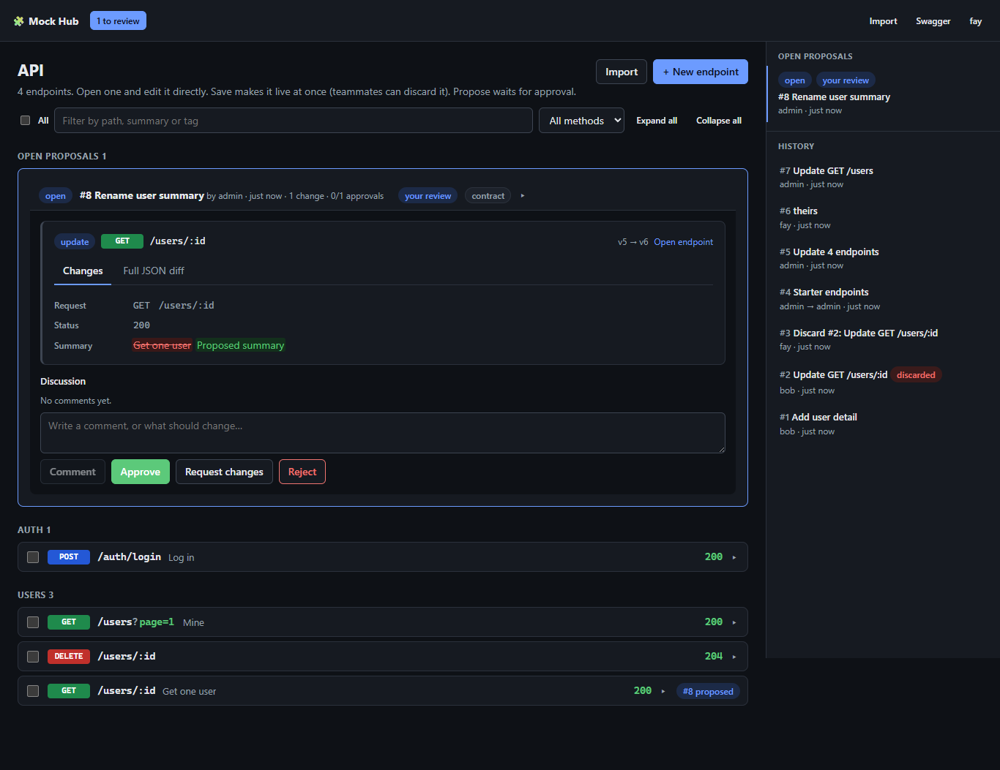
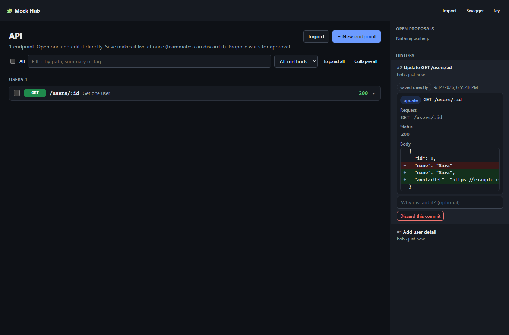
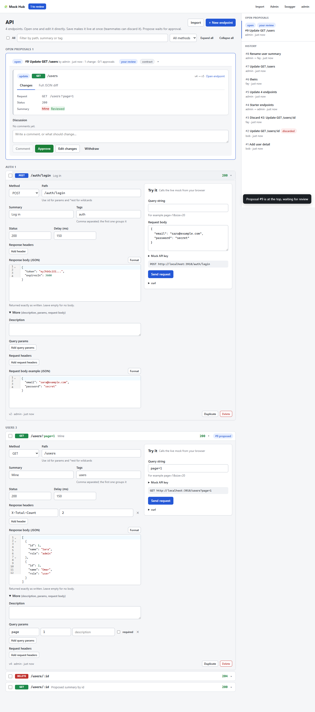

# API Mock Hub

A self-hosted mock API that frontend and backend teams edit together.
Define an endpoint with a static response, and it is callable right away at `http://<host>:<port>/<path>` and documented in Swagger.
Every change is recorded as a commit or a reviewed proposal, so nobody waits for anyone and nothing changes silently.

- **Backend** publishes the contract for endpoints it is still building. Frontend codes against it the same day.
- **Frontend** proposes the data shape it needs. Backend reviews, adjusts and approves.



## Features

- **Swagger-style workspace.** One page lists every endpoint. Open a row and edit method, path, status, headers, body, delay and request docs in place, next to a live "Try it" panel.
- **Save or propose.** Save applies your edits at once as a commit. Propose sends them for review; nothing goes live until someone approves.
- **Review on the same page.** Open proposals show every edit as a readable diff (`GET /users?page=1`, old values in red, new in green), a discussion thread, and Approve, Request changes, Reject and Withdraw buttons. Authors edit a proposal in place.
- **History you can undo.** Every commit is listed in the side panel with its diff. Any teammate can discard a commit, which undoes it for everyone as a new commit.
- **Safe concurrent editing.** Endpoints are versioned. If someone saves the same endpoint while you edit, you choose to keep your edits or take theirs.
- **Bulk changes.** Tick endpoints to set a delay or status, add or remove a tag, or delete them together.
- **Import and export.** Import hub JSON or a whole OpenAPI 3 / Swagger 2 document; export the live set as hub JSON or OpenAPI.
- **Real mock server.** Express-style paths (`/users/:id`, `/files/*rest`), most specific route wins, custom headers, simulated latency, CORS for any origin, optional API key.
- **Simple to host.** One Node.js process or Docker container. Data is plain JSON files with atomic writes.

| History and discard | Editing in place (light theme) |
|---|---|
|  |  |

## Quick start

### Docker

```bash
git clone https://github.com/Mehdy-AB/api-mock-hub.git
cd api-mock-hub
cp .env.example .env          # set ADMIN_PASSWORD (at least 6 characters)
docker compose up -d --build
```

Open `http://localhost:3000/_hub/` and log in as `admin`.
If you left `ADMIN_PASSWORD` empty, a generated password is printed once in `docker compose logs`.

Data lives in the `hub-data` volume. Back it up with:

```bash
docker run --rm -v api-mock-hub_hub-data:/data -v "$PWD":/backup alpine tar czf /backup/hub-data.tgz -C /data .
```

If the hub is reachable from the internet, put Nginx or Caddy with TLS in front and consider setting `MOCK_API_KEY`.

### Node.js

Requires Node.js 20 or newer.

```bash
npm install
npm run install:ui
npm run build:ui                              # the server serves client/dist at /_hub/
ADMIN_PASSWORD=admin123 npm run start:dev     # http://localhost:3000/_hub/
```

Run the tests with `npm test`.
For hot reload on the UI, keep the server running and start `npm run dev:ui`, then open http://localhost:5173/_hub/.

## URLs

| URL | What |
|---|---|
| `/<any path>` | The mock endpoints. No login needed. |
| `/_hub/` | Web UI |
| `/_hub/docs/` | Swagger of the live mocks. "Try it out" calls the real mock. |
| `/_hub/openapi.json` | OpenAPI 3 document of the live mocks |
| `/_hub/api-docs` | Swagger of the management API |

## Using the web UI

Everything happens on the API page.

1. **Edit.** Click a row to open it and change any field. "+ New endpoint" adds a row; each row also has Duplicate and Delete. Tick several rows for bulk changes.
2. **Save or Propose.** As soon as something differs from the live version, a bar appears at the bottom with an optional message, **Cancel**, **Propose** and **Save**. Edits across several endpoints go into one commit or proposal.
3. **Review.** Open proposals appear at the top of the page, with their edits, discussion and review buttons. Proposals waiting for you open automatically, and the header shows how many there are.
4. **History.** The side panel lists commits. Open one to see what changed, and discard it if needed. When an endpoint is selected, the panel shows only that endpoint's proposals and history.

A mock `404` response includes a `create` link that opens a new endpoint row with the method and path filled in.

Admins manage accounts and approval rules under **Admin**. Turning off "Save goes live at once" leaves only Propose, so every change needs approval.

## Configuration

| Variable | Default | Meaning |
|---|---|---|
| `PORT` | `3000` | Listen port |
| `DATA_DIR` | `./data` | Where the JSON data files live |
| `ADMIN_USER` / `ADMIN_PASSWORD` | `admin` / generated | First admin, created only when there are no users |
| `JWT_SECRET` | generated | Kept in `DATA_DIR/.jwt-secret` when not set |
| `JWT_EXPIRES_IN` | `12h` | Login lifetime |
| `MOCK_API_KEY` | empty | When set, mock calls need the header `x-mock-key` |
| `BODY_LIMIT` | `5mb` | Max JSON body for the management API |

The server reads `.env` from the folder it starts in. Real environment variables take priority.

`ADMIN_PASSWORD` is used only on the very first start, when the data folder has no users.
If nobody can log in later, set a password directly and restart the hub:

```bash
npm run build                                   # once, so dist/cli exists
npm run reset-password -- admin my-new-password
# with Docker:
docker compose exec api-mock-hub node dist/cli/reset-password.js admin my-new-password
docker compose restart
```

## Management API

Everything in the UI is also available over HTTP. The same calls have a form in `/_hub/api-docs`.

```bash
HUB=http://localhost:3000
TOKEN=$(curl -s $HUB/_hub/api/auth/login -H 'content-type: application/json' \
  -d '{"username":"admin","password":"admin123"}' | jq -r .token)
```

**Accounts.** Roles are `admin`, `backend` and `frontend`.

```bash
curl -s $HUB/_hub/api/users -H "authorization: Bearer $TOKEN" -H 'content-type: application/json' \
  -d '{"username":"sara","password":"secret123","role":"backend"}'
```

**Save directly** (applied at once; teammates can discard the commit):

```bash
curl -s $HUB/_hub/api/commits -H "authorization: Bearer $TOKEN" -H 'content-type: application/json' -d '{
  "title": "Add user detail endpoint",
  "changes": [{
    "type": "add",
    "endpoint": {
      "method": "GET", "path": "/users/:id", "tags": ["users"],
      "response": { "status": 200, "body": { "id": 1, "name": "Sara" } }
    }
  }]
}'

curl -i $HUB/users/42
# x-mock-hub: <endpoint id>@v1
# {"id":1,"name":"Sara"}
```

**Propose** with the same body at `POST /_hub/api/proposals`. Change types:

- `add` needs `endpoint`.
- `update` needs `endpoint` plus `endpointId` or `ref` such as `"GET /users/:id"`. It replaces the whole endpoint.
- `delete` needs `endpointId` or `ref`.

| Call | Effect |
|---|---|
| `GET /proposals?status=open,conflict&full=true` | Open proposals with their changes and diffs |
| `POST /proposals/{id}/reviews` | `{"decision":"approve"}` or `{"decision":"request-changes","comment":"…"}` |
| `POST /proposals/{id}/comments` | Add to the discussion |
| `PATCH /proposals/{id}` | Author or admin edits title, message or changes. New changes clear reviews. |
| `POST /proposals/{id}/rebase` | Resolve a conflict by basing the changes on the latest endpoints |
| `POST /proposals/{id}/reject` / `close` | Reject as a reviewer, or withdraw as the author |
| `GET /commits` / `GET /commits/{id}` | History, and one commit with diffs |
| `POST /commits/{id}/discard` | Undo a commit for everyone, as a new commit |

**Conflicts.** Every endpoint has a version. If two changes edit the same endpoint, the first one applied wins.
The other is marked `conflict`, and its author rebases or edits it. A commit can't be discarded while a later commit changed the same endpoint; discard the later one first.

## Import and export

`POST /_hub/api/import` turns a file into one proposal. New routes become adds, changed routes become updates, identical routes are skipped, and nothing is deleted. It accepts:

- a hub export `{ "endpoints": [ … ] }`, a plain array of endpoints, or one endpoint;
- a whole OpenAPI 3 or Swagger 2 document. The first 2xx response becomes the mock. Its example is used as the body, or a sample is generated from the schema.

```bash
curl -s $HUB/_hub/api/import -H "authorization: Bearer $TOKEN" -H 'content-type: application/json' \
  -d @examples/sample-import.json

# OpenAPI from a real backend, without its server path prefix
jq '{data: ., basePath: ""}' backend-openapi.json | \
  curl -s $HUB/_hub/api/import -H "authorization: Bearer $TOKEN" -H 'content-type: application/json' -d @-
```

Admins can add `?direct=true` to apply an import without review.

Check a file before importing it. This touches no hub and uses the same rules as the import:

```bash
npm run validate-import -- examples/02-orders-crud.json
```

The [`examples/`](examples/) folder has tested files for every feature: a single endpoint, full CRUD with errors and pagination, auth flows, an OpenAPI document, a re-import that updates, and a file full of common mistakes.

Export with `GET /_hub/api/endpoints/export?format=hub`, which re-imports cleanly, or `format=openapi` to hand the contract to the real backend.

## Approval settings

`PATCH /_hub/api/settings` as admin, or the Admin screen:

| Setting | Default | Meaning |
|---|---|---|
| `allowDirectCommits` | `true` | Save applies changes at once. `false` leaves only Propose. |
| `requireApproval` | `true` | `false` applies proposals as soon as they are created |
| `minApprovals` | `1` | Approvals needed |
| `approverMustDiffer` | `true` | Your own approval does not count. Admins can always approve their own proposals. |
| `requiredApproverRole` | `{ "publish": null, "request": null }` | For example `{ "publish": "frontend", "request": "backend" }`. Admins always qualify. |

A proposal's `kind` is `publish` for a backend contract or `request` for a frontend need. It defaults from the author's role.

## Mock behaviour

- Paths use Express style: `/users/:id` and `/files/*rest`. The most specific route wins, so `/users/me` beats `/users/:id`.
- Paths that differ only by parameter name or letter case count as the same route.
- `HEAD` falls back to the `GET` mock. `OPTIONS` is reserved for CORS, which allows every origin.
- The response sends `status`, `headers` and `body`, with an optional `delayMs` of up to 60 seconds. A `null` or missing body sends an empty response.
- Unknown routes return `404` with a hint.

## Project layout

```
src/            NestJS server: mock router, management API, storage, CLI tools
client/         React + Vite web UI, served by the server at /_hub/
test/           Unit and end-to-end tests (Jest + Supertest)
examples/       Import files for every feature
docs/           Screenshots
PLAN.md         Design notes and decisions
```

## License

[MIT](LICENSE)
